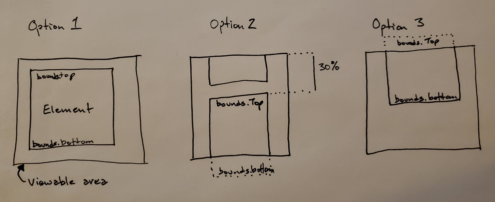

# Map Resume using MapboxGL Javascript

For geographers, like me, location matters. A resume with just the facts of a job don't tell the whole story of where that work was conducted. Travel and experiencing other cultures brings incredible skills that just don't translate to "worked with cross-cultural team." It also makes your resume a little more fun and interesting.

## Build this project

Using [Docker](http://docker.com), save this repo to your local machine. Navigate to the folder where you've saved this project. Open a terminal/command prompt and type `docker-compose up`. Open your browser to `http://localhost:4200`. Enjoy!

You can also pull the Docker image directly from DockerHub.

`docker image pull chadesmith42/map-resume:latest`

Then run, `docker run -d -p 4200:80 --name map-resume chadesmith42/map-resume`. Open your browser to [localhost:4200](http://localhost:4200) to view the application.

After you have finished, you remove the image and container from your computer by running the following commands in order:

`docker container stop map-resume`

`docker container rm map-resume`

`docker image rm chadesmith42/map-resume:latest`

## Attribution

I loosely based this project on a published web-map project I found online. Despite my best searching efforts, I haven't found the site as of the time of this publication. I wish that I could, so I could provide some credit where it is due. Some of the heavy lifting was done through that project. I modified my project to meet my needs, but I did get some core ideas of how to approach this via another developer. I'll update this portion as soon as I can find the project.

## Mapbox GL Javascript

I choose Mapbox GL library as my mapping javascript library for two reasons:

1. I had worked with Mapbox's software and services before. They're a good company and have great products that are easy to use.
2. They offer __*FREE*(!!!)__ usage of their library. If you want use their tiles (background or basemap), there are free tiers that will work for most projects.

## Structure

This project can be a single page. I broke it out into multiple files in order to facilitate ease of development. That's a personal choice. Obviously, you can go your own way! I ran into issues with CORS using data in separate files. Eventually, I put the data back into the scripts in order to get the project completed.

 If you want to see how to use Google Sheets as your data repository, I found this example using Leaflet and Google Sheets: [DataVizForAll](https://github.com/DataVizForAll/leaflet-storymaps-with-google-sheets).

## Making the Map

### Using other tile sources for your map

I like Mapbox. I have an account and have several projects that use their tiles. The tiles are clean, well thought out, have good support, and are easy to use.

I don't like having my Access Token out in public. Especially when I have to pay for specific things. Rather than spend tons of time using various methods to lock-down my access token behind the scenes, I'm using third-party tiles.

You can find tons of options for tile sources. My preferred brand is [Stamen Maps](http://maps.stamen.com). In order to use raster-tiles, you need to add little more to your `style` declaration in the `map` instantiation:

```javascript
style: {
        version: 8,
        sources: {
            'stamen-toner': {
                type: 'raster',
                tiles: [
                    'http://tile.stamen.com/toner/{z}/{x}/{y}.png'
                ],
                tileSize: 256,
                attribution: 'Map tiles by <a href="http://stamen.com">Stamen Design</a>, under <a href="http://creativecommons.org/licenses/by/3.0">CC BY 3.0</a>. Data by <a href="http://openstreetmap.org">OpenStreetMap</a>, under <a href="http://www.openstreetmap.org/copyright">ODbL</a>.'
            },
        },
        layers: [
            {
                id: 'stamen-toner',
                type: 'raster',
                source: 'stamen-toner',
                minzoom: 0,
                maxzoom: 22
            }
        ]
    },
```

### Adding Markers to the Map

I created a simple function that takes the place data and creates new markers on the map for each place.

```javascript
function CreateMarkers()
{
    map.addSource('markers',
        {
            type: 'geojson',
            data: markerPoints
        });
    map.addLayer({
        id: 'markers',
        type: 'circle',
        source: 'markers',
        paint: {
            'circle-radius': {
                base: 14,
                stops: [
                    [0, 10],
                    [22, 180]
                ]
            },
            'circle-color': "#43b0f1",
            'circle-opacity': .75,
            'circle-stroke-color': "#1e3d58",
            'circle-stroke-width': 4
        }
    })
}
```

In order to add any data to Mapbox, you must first create a Source. You can create multiple layers from the same source, just as you can reuse CSS classes, variables, or databases, etc. The source is given a name and passed a SourceOptions object. In this case, I'm using geoJSON, so the `type` is `geojson` and the `data` refers back to my object containing the place data, in this case, `markerPoints`.

Once the Source is created, you can create a Layer to display on the map. In my use, I left the `id` as `'markers'`. If I were making multiple Layers from the same Source, each `id` would be different. __Mapbox will throw an error if you try to reuse the same `id`.__

The interesting part for the markers is that I wanted the points to basically look the same no matter what zoom level you view the map. The values are pixel based, but it's relative to the map's extent. A building with a roof that is 10 feet by 10 feet looks different from an adjacent building, from a jet airliner, from the International Space Station or from Mars. So in order to make the circles look the same, I used a function.

The `stops` argument provides key value pairs for the property based on zoom level. Mapbox fills in the intermediate zoom levels with values that are on par with the original values. At zoom level 0, the circle size is 10 pixels. At zoom level 22, the circle size is 180 pixels.

### Focusing the map on the content location

I created a data-set that has map settings for each location. These aren't just recentering the map. For some cases, I wanted points that are close to other points to be the only point shown. That required some changes in map bearing, tilt, zoom, etc. The `chapters` object contains all of the various settings for these map changes.

```javascript
var chapters = {
    centriq: {
        bearing: 0,
        center: [-94.61131, 38.9693],
        zoom: 13,
        pitch: 20
    },
    esri: {
        bearing: 0,
        center: [-117.190277, 34.05724],
        zoom: 13,
        pitch: 20
    },
    denton: {
        center: [-97.1563381, 33.2108131],
        bearing: 35,
        zoom: 13.5,
        pitch: 20
    }, ...
 // code omitted for brevity>
```

I used three functions to modify the map and the text content based on scrolling behavior.

#### What's on the screen?

I created a function to check if a DOM element is visible on the browser's screen.

```javascript
function isElementVisible(id)
{
    var bounds = document.getElementById(id).getBoundingClientRect();
    var viewHeight = Math.max(document.documentElement.clientHeight, window.innerHeight);
    var mapContainer = document.getElementById("map-container").getBoundingClientRect();
    var aboveHorizon = viewHeight > bounds.top;
    var bottomAboveHorizon = viewHeight > bounds.bottom;
    var mostlyOffPage;
    var bottomOffPage;
    if (document.documentElement.clientWidth < 601) // mobile settings;
    {
        // viewHeight - mapContainer.bottom is top of "features" display area
        var triggerPoint = (viewHeight - mapContainer.bottom) * .30;
        mostlyOffPage = bounds.bottom < triggerPoint + mapContainer.bottom;
        bottomOffPage = bounds.bottom < mapContainer.bottom;
    } else { // desktop settings;
        mostlyOffPage = bounds.bottom - Math.floor(bounds.height * 0.30) < 0;
        bottomOffPage = bounds.bottom < 0;
    }
    if (mostlyOffPage) return false;
    return (aboveHorizon && !bottomAboveHorizon) || (aboveHorizon && !bottomOffPage);
}
```

I pass in the `id` of the DOM element as an argument. The `id` comes from the `chapters` object identified in the previous section. __NOTE:__ *Originally, I wrote this function to deal with desktop browsers only. However, I've since updated the CSS to create a mobile-friendly version of this site. That required some rethinking of this function.*

The `bounds` variable is the actual position of the DOM element's box on the screen. Since we're looking for the "*top*" element on the page, there are several checks to perform. If the page is a desktop, we're checking if the top of the element is above the bottom of the viewable area (referenced as `horizon`) __and__ the bottom of the element cannot be above the top of the viewable area.



I wanted the application to switch focus to the next portion of the map after the previous element is scrolled "mostly off of the page." For mobile, that means the bottom of the element cannot be more than 30% of the element's height away from the bottom of the map. On desktop, the element cannot be less than 30% of the element's height from the top of the viewable area. See __Option 2__ in the figure above.

Any element that has been viewed will have it's `bounds.top` above the top of the page. However, if the element is still on the screen, it's `bounds.bottom` cannot be less than top of the page. See __Option 3__ in the figure above.

If the DOM element is at the top of the page, what then?

#### Set a class and move the map

Usually, if you want to toggle a DOM element's class, you would use something like this:

```javascript
document.getElementById(id).classList.toggle('someClass');
```

However, for this project, we're triggering the toggle based on a `scrollEvent`. That happens often enough that it creates some rendering issues. (I had issues because I am highlighting the content based on the map's location.) So how do you get around that?

I set a check on the DOM element for the class before I toggled it.

```javascript
function setActiveChapter(chapterName)
{
    if (chapterName === activeChapterName) return;
    map.flyTo(chapters[chapterName]);
    if (!document.getElementById(chapterName).classList.contains('active'))
    {
        document.getElementById(chapterName).classList.toggle('active');
    }
    if (document.getElementById(activeChapterName).classList.contains('active'))
    {
        document.getElementById(activeChapterName).classList.toggle('active');
    }
    activeChapterName = chapterName;
}
```

You could use `.toggle('someClass',true)` to apply the `force` parameter. This will only add the class or remove the class once. However, that still resulted in multiple changes per second and was resulting in issues with rendering.

By checking if the property exists before toggling the class, the `toggle()` is only done once. The flickering stops. I would put up the older version, but those susceptible to seizures might not appreciate the effort.

You'll notice, this is where the map is actually changed.

```javascript
map.flyTo(chapters[chapterName]);
```

That sets the map to proper location, using the zoom, tilt, bearing, and speed settings in the `chapters` object.

Also, this function does a self-identity check. If the variable passed into the check is already the 'active' location, the function terminates.

#### Tie it all together

So far, I've coded a function to determine if the DOM element is visible on the screen and a function to toggle the class. This is the function that ties the previous two functions together. I iterate through each chapter name, determine if it's on the screen and then set it's class appropriately.

```javascript
function MoveMap()
{
    var chapterNames = Object.keys(chapters);
    for (var i = 0; i < chapterNames.length; i++) {
        var chapterName = chapterNames[i];
        if (isElementVisible(chapterName)) {
            setActiveChapter(chapterName);
            break;
        }
    }
}
```

Since we don't need to keep iterating through the `chapters` object after we find the top DOM element, we simply `break` once that DOM element has been set to active.

```javascript
var activeChapterName = "overview";
var features = document.getElementById("features");
var pageWidth = document.documentElement.clientWidth;

window.onscroll = function ()
{
    MoveMap();
};

features.addEventListener("scroll", function() {
    if (pageWidth < 601) {
        MoveMap();
    }
});

```

When the page first loads, the `overview` section is at the top. So we declare the initial value of the `activeChapterName` to be the first section on the page. I then set two event handlers for scroll events. For both event handlers do the same thing, but I only need the `features` event handler for mobile screens. I did attempt to simplify this much more, but my timeline got the best of me. (*Maybe for version 1.0.*)

## Controlling the Page Content with the Map

So this was way easier than I thought it would be. I added a `location` property to the `chapters` object, inside the geoJSON `properties`.

Clicking on the map's points will already open the popup. That click event returns the `features` which were clicked. Features will almost always be an array, but for my application, that's typically one point.

#### What did you click?

First, we identify the DOM element that corresponds to the clicked marker.

```javascript
var pageLocation = document.getElementById(e.features[0].properties.location);
```

Remember how I wrote that `features` will always be an array, but there could be multiple points? I'm taking the first point in the array.

#### The `scrollIntoView()`  is your friend

```javascript
pageLocation.scrollIntoView(true);
```

This causes the page to scroll until the top of the DOM element is aligned to the top of the page. It's really that simple.

Even on the mobile version, where "top of the page" is actually in the middle, `scrollIntoView(true)` still puts the selected element at the top of the scrolling area.
